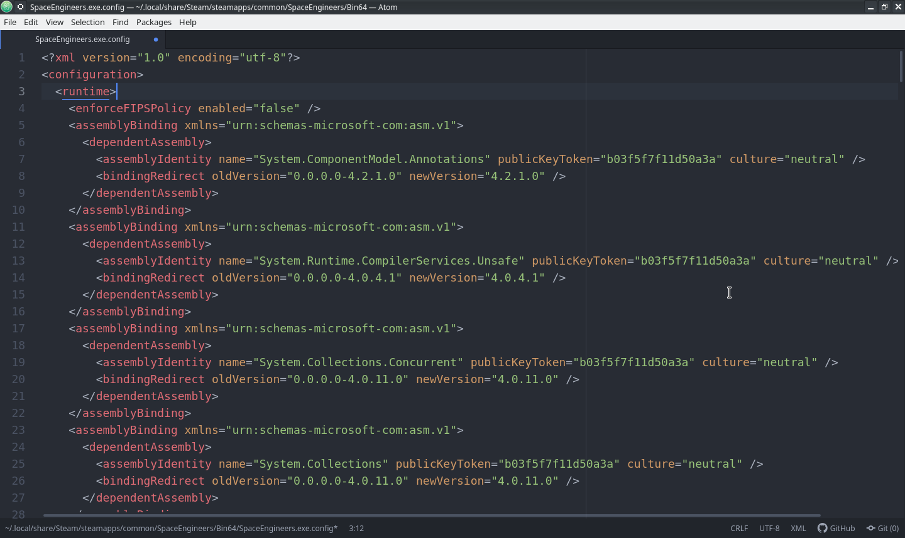
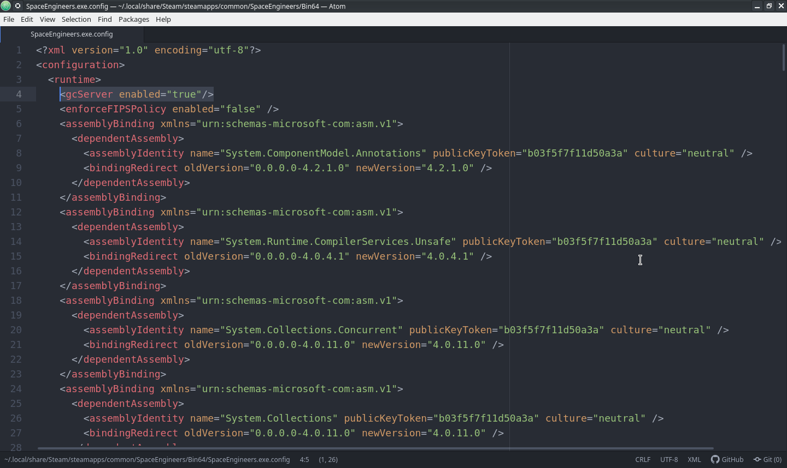
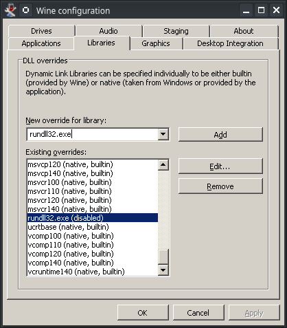

# This is currently the easiest solution to getting Space Engineers to run smoothly using DotNet:
### This guide assumes you have already have Steamplay/Proton installed with all of the prerequisites and such, as well as Space Engineers, and winetricks. If not, you can check around the internet for guides that can explain it much better than I can!

#### Here is a list of Known Issues, and potential solutions:

1. [Freeze at starup](#issue-1)

2. [rundl32.exe error popup](#issue-2)

3. [Looping Sound](#issue-3)

4. [Popping/Crackling Sound](#issue-4)

5. [Mouse/Keyboard issues when changing window focus(alt+tab)](#issue-5)

6. [Game crashes shortly after start with `System.OutOfMemoryException: Array dimensions exceeded supported range.` error in log.](#issue-6)

7. [Game hardlocks(sometimes including entire OS) when using 5700/5700xt](#issue-7)

8. [SpaceEngineers.exe becomes zombie on exit](#issue-8)

# New Automated Setup Guide:

#### This can patch the original SE DOTNET issue and several others.

### Step 0) Prerequisites

This java program simply requires Java 7 or later. This should be standard on most modern Linux systems. If it is not you can search the internet for a specific guide on how to install it for your particular Linux distribution.

### Step 1) Get it

Download this pre-compiled jar file: 
If you would like to look at the source code or compile it yourself it is in this repository as Source-PatchGUI.java

### Step 2) Run it

Simply double click it and it should open. The program should be fairly intuitive and has a built-in help feature.

IF YOU CAN NOT START THE PatcherGUI.jar, because computers… THEN CONTINUE. 

Some distros special circumstances do not allow you to simply double click the jar and have it run.

### Step 3) Make it runnable

On some Distros and Desktop Environments you can simply right click on the PatcherGUI.jar file, then click properties > Permissions and ensure the check box: Is executable is marked.

## OR

You can open your terminal/console of choice and cd into the directory where the PatcherGUI.jar file is located, and run 'sudo chmod a+x PatcherGUI.jar'

### Step 4) Open the GUI through command line

Using your favorite terminal/console program, cd into the directory and run 'java -jar PatcherGUI.jar'

# The Old Automated Setup Guide:
### This will create the wineprefix and modify the config file for you. If you want you can scroll down and find the manual instruction on what this patcher automates.

## Step 0:
  Backup any save data, blueprints, ETC...
  Then verify the integrity of your game files in Steam.

## Step 1:
  Ensure prerequisites are installed and up to date.
  
  Wine(5.0 or higher... although the newest version is recommended). Find out more at winehq: https://wiki.winehq.org/Download
  
  Winetricks: from here https://wiki.winehq.org/Winetricks then:
  
  `sudo winetricks --self-update`
  

## Step 2:
  Download(Save to downloads) this python script: 
  
  Run this script with 
  
  `python3 autoprefix-patcher.py`
  
  Note: The script will ask you if it needs help, so make sure you read what it says! It can apply another fix for one of the issues below(freeze at startup) and will ask you if you want to fix it.

 Congratulations Space Engineers should now work properly on Linux. Have fun and enjoy!

# The Manual Setup Guide(Skip if you used the autopatchers, and they seemed to work):

## Step 0:
  Backup any save data, blueprints, ETC...  
  Then verify the integrity of your game files in Steam.

## Step 1:
Ensure prerequisites are installed and up to date.
  
  Wine(5.0 or higher... although the newest version is recommended). Find out more at winehq: https://wiki.winehq.org/Download
  
### With winetricks
  Ensure winetricks is up to date.

  `sudo winetricks --self-update`
___________________
### OR with protontricks (You can use protontricks is you already have it installed.)

  Ensure protontricks is up to date.
  
  follow the instructions  based on how you installed it.

## Step 2:
### With winetricks

  Create your wine prefix with winetricks in the compatdata folder in steamapps/common/

  `WINEPREFIX="INSERT/DIRECTORY/TO/SPACEENGINEERS/pfx" winetricks --force -q dotnet472 vcrun2015 faudio d3dcompiler_47`
___________________
### OR with protontricks

  Create your wine prefix using protontricks if it is already installed, or if you want to install it from the instructions .
  
  protontricks 244850 --force -q dotnet472 vcrun2015 faudio d3dcompiler_47
  

## Step 3:
  Open your Space Engineers bin64 directory: usually at $HOME/.local/share/Steam/steamapps/common/SpaceEngineers/Bin64

  In this folder find the file **SpaceEngineers.exe.config** and open it in a text editor(Gedit, Kwrite, ETC...). 

  You should see something like this:
  
    
  

## Step 4:
  Now add `<gcServer enabled = "true"/>` to a new line after the line that says `<runtime>`
  It should now look like this:
  

  Save the file and close it.

  Congratulations Space Engineers should now work properly on Linux. Have fun and enjoy!

  Note you may have to reapply these fixes if the game updates. It depends on if the file is changed durring the update.
  If you encounter issues try following these steps again.
___________________  

  # Known issues:

  ### Issue 1:  
  Broken startup and missing videos, causing startup freeze that requires user input to get past the splash screen.

  ### Known Fix:
  Rename the file here: "LOCATION_OF_SPACE_ENGINEERS_INSTALL/SpaceEngineers/Content/Videos/KSH.wmv to KSH.wmv.old
___________________  

  ### Issue 2:  
  Upon startup the game will show this error one or more times.

  

  ### Known Fixes:
  1) Just hit no each time it appears. It should not impact the ability of the game to run.

  #### OR

  2) Run `WINEPREFIX="INSERT/DIRECTORY/TO/SPACEENGINEERS/pfx" winetricks`
  In the library tab of the configuration window add rundll32.exe to the New override for library box and click add. Then find it in the list below and click edit and ensure disabled is selected. (See image below:) Click apply, then close the window.

  
___________________  

  ### Issue 3:  
  Some users report that faudio has looping sound issues.

  ### Known Fix:  
  None is known at this time. More testing is required.
___________________  

  ### Issue 4:
  While using faudio some users report crackling or popping audio.

  ### Known Fix:
  Try adding the following to your steam launch options(right click Space Engineers in steam, click Properties, then in the General tab, click SET LAUNCH OPTIONS...) add the following in the box that appears.  

  A) If something is already in the box add PULSE_LATENCY_MSEC=60 after those items but before %command% 

   e.g. `DXVK_HUD=full PULSE_LATENCY_MSEC=60 %command%` Make sure you have spaces between each item.

 B) If the box is empty add:

   `PULSE_LATENCY_MSEC=60 %command%`
    
   Then hit ok on the launch options window. If you are still experiencing issues, try modifying the value of PULSE_LATENCY_MSEC try 30, or 90 instead of 60.
___________________  

  ### Issue 5:  
  When the user alt+tab from the game, the game will keep the mouse from moving to another screen or selecting other windows. It also prevents keyboard input to other windows, even if they are on the same screen, or there is only one monitor.

  ### Known Fix:  
  The known workaround causes more issues than it fixes. If you are so inclinded to try it you can find it in issue  #Be warned this fix breaks other things. Try at your own risk!
___________________  

  ### Issue 6:  
  Game crashes shortly after start with `System.OutOfMemoryException: Array dimensions exceeded supported range.` error in log.

  ### Known Fix:  
  Game sends analytics to 81.0.234.196 and 88.146.207.227 (Keen SWH analytics servers) which apparently sends back some garbage that causes the issue (unintentionally). To resolve the issue block this service via:
  
  `sudo iptables -A INPUT -s 88.146.207.227 -j DROP`
  
___________________  

  ### Issue 7:  
  The game will freeze and accept no input just after loading a world. This will also sometimes lockup the OS. This seems to only happen on the newest line of AMD graphics cards(currently tested(5700/5700XT)).

  ### Known Fix:  
  Set the in-game voxel quality to it's lowest setting. This seems to have solved the issue.
___________________
 

  ### Issue 8:  
  From this issue https://github.com/Linux74656/SpaceEngineersLinuxPatches/issues/26
  
  SpaceEngineers.exe refuses to die after exiting the game.

  ### Known Fix:
  You can take a look at this script by inetknght:
  https://github.com/inetknght/linux-profile/blob/master/.bash/kill_space_engineers.bash
  
  It will help eleminate those pesky zombie processes.
___________________  

  ## Special thanks to InflexCZE for taking the time to help. Without his help it could have taken many more months to figure this out.
  ## and Huge thanks to everyone else on https://github.com/ValveSoftware/Proton/issues/1792 for helping solve these issues.
